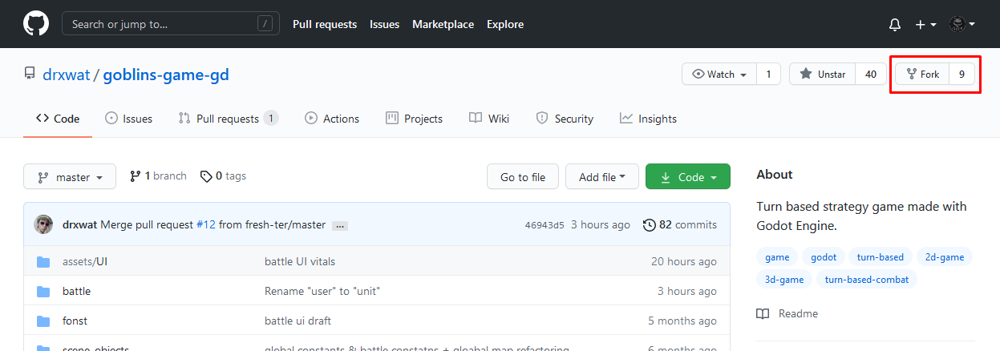
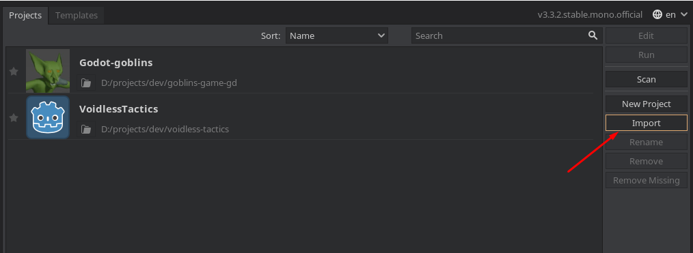
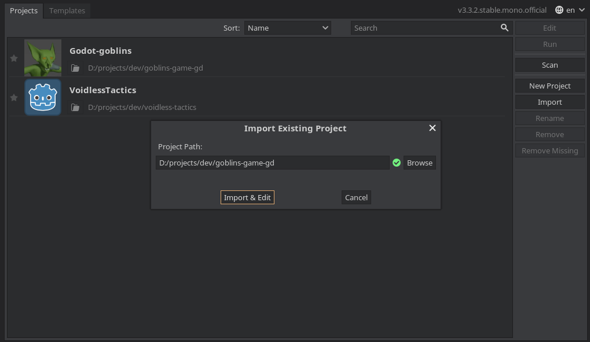
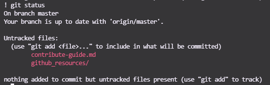
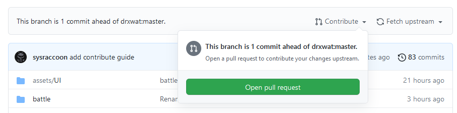
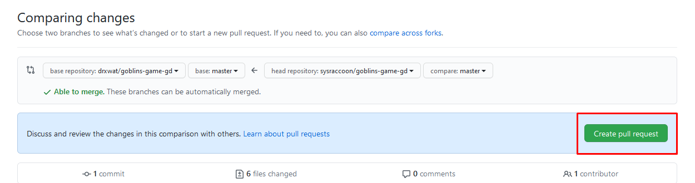
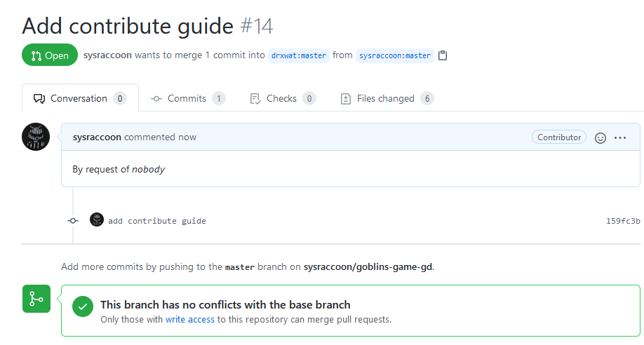
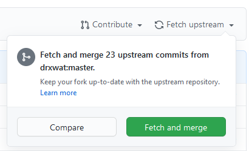

**Как внести свой вклад в проект**

Создаём форк [проекта](https://github.com/drxwat/goblins-game-gd):



Клонируем его себе на компьютер командой ниже. Заменив `<username>` на ваш ник:

**Важно** - ниже используется клонирование и с использованием ssh, для того чтобы иметь возможность в дальнейшем вносить изменения в ваш форк необходимо настроить ssh-ключи в вашем профиле. О том как это делается [описано тут](https://docs.github.com/en/github/authenticating-to-github/connecting-to-github-with-ssh/generating-a-new-ssh-key-and-adding-it-to-the-ssh-agent)

```
git clone git@github.com:<username>/goblins-game-gd.git
```

Для пользователей Windows:

```
git config --global core.autocrlf input
```

Открываем проект в годо и жмём `import`



Указываем путь к склонированному проекту



Делаем изменения которые считаете необходимыми или которые есть на доске [trello](https://trello.com/b/XNZWmtdJ/godot-goblins-turned-based-game)

Просмотреть сделанные изменения можно через следующие команды:

```
git status # Показывает какие файлы поменялись
git diff # Показывает изменения во всех файлах
git diff filename # Показывает изменения сделанные в определённом файле
```



Фиксируем изменения следующими командами:

```
git add . # Или указывает определённые файлы если не всё должно попасть в итоговый вариант
git commit -m "change description" # Делаем коммит описывая что поменялось
git push # Отправляем наши изменения на github
```

В интерфейсе github открываем страницу с форком и жмём `open pull request`:





Дожидаемся пока @drxwat примет изменения:



В дальнейшем если в оригинальном репозитории появляются новые коммиты, необходимо синхронизировать форк. Для этого жмём `fetch & merge` на странице форка:



И подтягиваем изменения на компьютер
```
git pull
```

Возвращаемся к пункту с внесением изменений и повторяем по новой